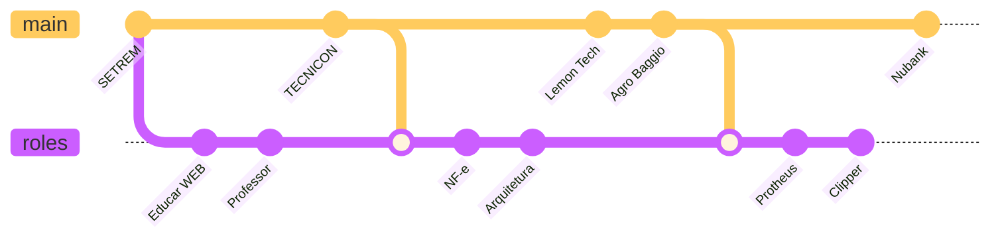

# Bate papo

Carreira como developer

<!-- 

  
    Press Space for next page <carbon:arrow-right class="inline"/>
  

 -->

  <!-- <button @click="$slidev.nav.openInEditor()" title="Open in Editor" class="text-xl icon-btn opacity-50 !border-none !hover:text-white">
    <carbon:edit />
  </button> -->
  <a href="https://github.com/slidevjs/slidev" target="_blank" alt="GitHub"
    class="text-xl icon-btn opacity-50 !border-none !hover:text-white">
    <carbon-logo-github />
  </a>

<!--
The last comment block of each slide will be treated as slide notes. It will be visible and editable in Presenter Mode along with the slide. [Read more in the docs](https://sli.dev/guide/syntax.html#notes)
-->

---
layout: image-right
image: https://images.unsplash.com/photo-1512255076928-7f75507c1e32?ixlib=rb-1.2.1&ixid=MnwxMjA3fDB8MHxwaG90by1wYWdlfHx8fGVufDB8fHx8&auto=format&fit=crop&w=987&q=80
---
# Agenda

- 🧑‍💻 Escolha da área de TI
- 🛠 Carreira
- 📝 Como Estudar
- 🔥 Burnout
- 🚀 Nubank

---
layout: image-left
image: ./imgs/tibia.jpeg
---
# Escolha da área?

.

- Tibia

- PHP 4

- Parceirias
---

# Carreira

---
layout: image-right
image: https://images.unsplash.com/photo-1608099269227-82de5da1e4a8?ixlib=rb-1.2.1&ixid=MnwxMjA3fDB8MHxwaG90by1wYWdlfHx8fGVufDB8fHx8&auto=format&fit=crop&w=985&q=80
---
# Estudos

* Clube delphi
* Livros técnicos
* Reinventar a roda

---
layout: image-left
image: https://images.unsplash.com/photo-1622641146379-2672c7437900?ixlib=rb-1.2.1&ixid=MnwxMjA3fDB8MHxwaG90by1wYWdlfHx8fGVufDB8fHx8&auto=format&fit=crop&w=987&q=80
---
# Burnout

O que é, de onde vem, do que se alimenta.

---
layout: image-right
image: ./imgs/purple.png
---

# Nubank

* Programação Funcional
* Worklife balance
* Tests everywhere

---
layout: center
class: text-center
---

# Refs

* Unsplash
* TibiaBR
